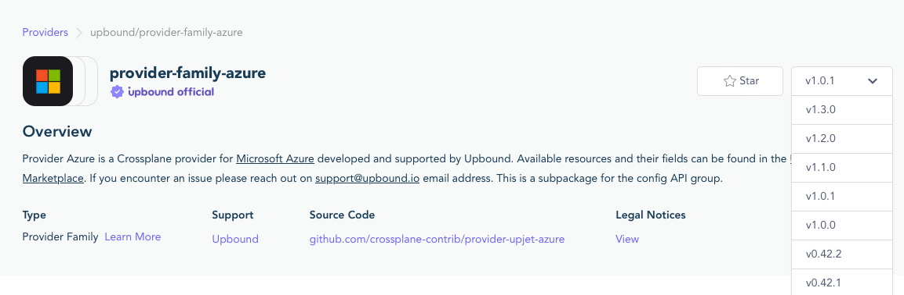
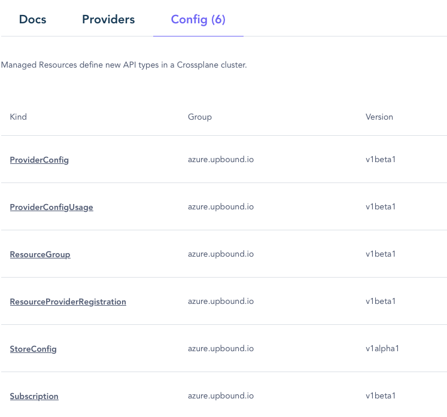
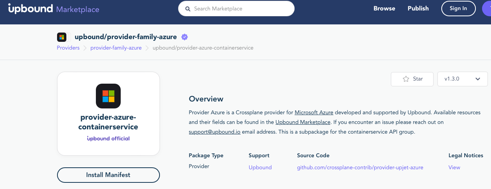
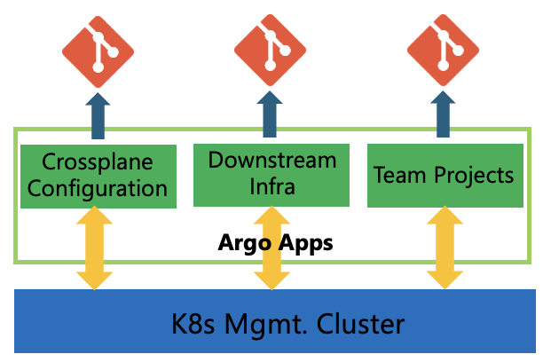
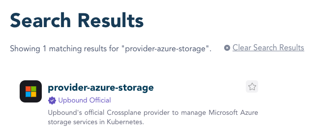
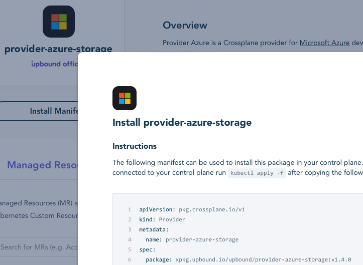
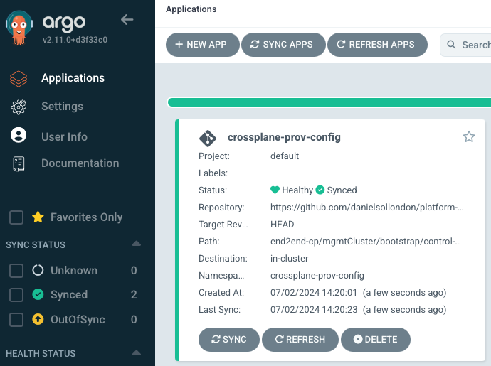

# Cloud Native Platform Engineering Concepts with Azure Part 1 (DRAFT)

## Agenda
* Intro
* Goals of document
* Architecture
* Tools
* Examples
  * Part 1: Create, Configure Mgmt Cluster, Repo, Tools and Deploy Infra
  * Part 2: Deploy Preconfigured, Standardized Solutions in Azure
  * Part 3: Deploy a Cloud Native App with a Full App Environment in Azure

## Introduction and motivation
When I started in the platform engineering journey I had familarity with Terraform and pipelines such as GitHub Actions, Azure DevOps and challenged myself to enable some key platform engineering self service scenarios building on some popular cloud native OSS tools on Azure and callout some of learnings.

With the emergence of platform engineering practices and associated cloud native tooling there is a lot to consider, especially if you are not so familar, it feels bewildering when you start, for example, which tools should I evaluate, what do they do, how do I integrate them. You may review really great frameworks that build a lot of the functionality out for you, but if you don't understand how the tools integrate it makes it hard to adopt them and modify them for your own purpose.

This is written for people who are working to achieve a basic platform built on cloud native technology that can deploy infra and apps in a scaleable, standardized and compliant approach on Azure. It is designed to compliment frameworks, to help you understand how the components work etc.

This document is not:
* An endorsement of any specific tool, we have chosen some popular OSS tools,
* A best practice guide, it shows examples, there are many opportunities for optimization, you will still need to review specific tool and security guidance.
* Finished - it is a constantly being updated, and relies on people raising issues and PR's to improve it!


## Goals of document
By the end of the document you will have:
* Understanding of:
  * Tools - Have an understanding of some of popular cloud native infrastructure as code tools, and how they compare to existing tools, and tools that enable automation.
  * Concepts - that are required to create a foundational, scaleable self service experiences, e.g. apps of apps pattern etc.
  * How the approach fits into a bigger picture with existing developer flows with build and deploy.
  * Frameworks that build this out for you, e.g. [Azure Platform Engineering Sample](https://github.com/Azure-Samples/aks-platform-engineering
  ).
* Code samples for:
  * Self service deployment of dedicated and shared infrastructure. 
  * Self service deployment of application environments - i.e. all the resources you need to deploy an application
  * Self service deployment of applicatons or configurations on clusters
* Azure'isms - insights into making them work on Azure.

## Components
For the initial release of this document we are going to focus on:
* Cloud native Infrastructure as Code (IaC)
* GitOps Continous deployment tooling to deploy apps and infra.

You will also need a repositry for configurations, we will use GitHub but not cover this.

### Infrastructure as Code
There are multiple IaC choices that are available, for example:
Cloud Native IaC - these are installed on K8 “management” clusters and cloud resources are represented as custom resources in K8s.
* [CAPI](https://cluster-api.sigs.k8s.io) – The cluster API (CAPI) framework and language has 30+ providers (e.g. AWS, GCP, bare metal) enabling IaC in a similar language and common core code base. The cluster api provider for Azure (CAPZ)  allows you to deploy self-managed K8s on Azure and AKS clusters.  
* [ASO v2](https://azure.github.io/azure-service-operator/) - Azure Service Operator, you can deploy many Azure resources, not just AKS.  This is also now deployed by default along with and utilized as a dependency by CAPZ.
* [Crossplane](https://www.crossplane.io) - you can deploy resources into multiple clouds, this is the tool we will demonstrate due to it's multicloud capabilties, however you can swap this out for any of the above tools.

All of these tools require a Kubernetes (K8s) cluster that will host them, typically, at a high level they will install [K8s Custom Resource Definitions](https://kubernetes.io/docs/concepts/extend-kubernetes/api-extension/custom-resources/#customresourcedefinitions) and then use an identity to connect into Azure to perform infrastructure actions. Cloud infrastructure resources are represented as K8s resources, and track the resource state.

#### What are the key advantages of cloud native IaC?
* Automation & Drift Detection – Cloud native IaC options can be used with automation such as GitOps tools, this means you can get benefits of GitOps, such as automated resource drift detection out of the box.  Kubernetes works very well as a continuous reconciliation loop versus other non-cloud based IaC options (such as Terraform) that have lock files, state, and drift is only detected on a redeployment of the IaC configuration, leading to delays in detecting drift and reconciliation errors.
* Control Plane security – With cloud native tools the security of what is deployed is controlled through the K8s control plane, therefore you can restrict people having direct access to cloud control planes and resources. 
* Custom resources – You can create a Kubernetes resource that represents multiple infra resources or a represent a resource with a specific set of defaults and exposed properties. An example of these are Composite resources (Crossplane XRD’s) and Cluster Classes in CAPI. 
* Heterogeneous cluster type common tooling – for instance, you can deploy a self-managed K8s cluster, AKS cluster, and AKS cluster joined to a fleet management hub in the same manner along with the associated applications across all of them.

#### Cloud Native IaC considerations
* K8s cluster & experience – Ops teams need to grow skills in maintaining K8s infrastructure management clusters.
* Getting started – Ops teams will need to learn how to define resources in cloud native templates.
* Existing investments – this document is not suggesting that you should scrap existing investments, you should review how the technincal benefits provide business value and start small. You can perform self-service using existing deployment pipeline technologies such as GitHub Actions, DevOps and IaC tools such as Terraform, Bicep, ARM templates etc.

### Continuous Deployment (CD) Pipelines
For this we are are going to use GitOps based CD pipelines, popular tools examples, Argo, Tekton, Flux. These tools  reconcile the infra or application configuration in a repositry with the K8s cluster.

We will use [Argo](https://argoproj.github.io) in the example, but you can use other tools, the main benefit of GitOps is scale, configuration portabiltiy, drift detection, automation, auditing and approval etc. A key difference between GitOps and other CD pipelines such as Jenkins, GHA, DevOps is that they are push based pipelines that run outside of the K8s cluster, requiring connectivity details for the K8s cluster. Whereas with GitOps tools have an agent that is installed on the cluster and you add a configuration to the agent, it will then reach out to a configuration repo and 'pull' in the configuration. There is a lot more detail in this area, for more information take a look [here](https://opengitops.dev/) as well as the project content.


Lets get building.....

## Part 1: Create, Configure Mgmt Cluster, Repo, Tools and Deploy Infra


### Tooling & purpose
* Cloud native IaC tool - this tool will enable the LCM of infra resources across any clouds you chose, for this example we are going to show Crossplane.
* GitOps - this tool will reconcile the infra configuration in a repositry with the management cluster and ensure the configuration is applied. We will use Argo in the example, but you can use other tools.
* Management AKS cluster - this is required for GitOps and IaC tooling, in this example we're going to use a generic AKS cluster.
* Repo - this is where you will host your configurations for:
    1. The Management cluster configuratation - this configuration will be used by crossplane.
    2. Infra configurations - configurations of deployments.
    3. Configuration library - configurations available to teams.
* All of these steps can be automated, but here we are working through a step by step approach to help you understand how the stack works.

1. Create a Private GH Repo
Clone or manually copy this repo to your own private repo and for this example we'll create 3 folders, but you should think about the best structure for your organization, there is also a good example [here](https://github.com/Azure-Samples/aks-platform-engineering).
    * /mgmtCluster/bootstrap/control-plane/addons
    * /workloads/team01
    * /catalog/k8s

2. Management Cluster
We need a management cluster to install Crossplane on, below is an example using AZ CLI, however you can automate this using Terraform etc.

> NOTE: Before proceeding:
  * decide how you wish Crossplane to authenticate with Azure! There are a couple of methods, for example you can use the [System Assigned Managed Identity](https://docs.upbound.io/providers/provider-azure/authentication/#system-assigned-managed-identity) (SAI) of the AKS cluster, or you can use a specific [User Assigned Identity](https://docs.upbound.io/providers/provider-azure/authentication/#user-assigned-managed-identity) (UAI). 
  * Check the Crossplane documentation for the latest install methods.


You should evaluate which mode is most appropriate for your security requirements, however if you choose UAI you need to ensure your AKS cluster is configured with it at this step, which we will walk through now.


```bash
# set vars
mgmtClusterName=main-infra002
resourceGroup=rg-infra-01
location=westus2
cpAksUai=cp-infra002-uai
kblAksUai=kbl-infra002-uai

# create resource group
az group create --name $resourceGroup --location $location

az identity create --name $cpAksUai --resource-group $resourceGroup
az identity create --name $kblAksUai --resource-group $resourceGroup
cpAksUaiId=$(az identity show --name $cpAksUai --resource-group $resourceGroup --query id --output tsv)
kblAksUaiId=$(az identity show --name $kblAksUai  --resource-group $resourceGroup --query id --output tsv)

# create mgmt cluster
az aks create \
--resource-group $resourceGroup \
--name $mgmtClusterName \
--node-count 1 \
--enable-cluster-autoscaler \
--enable-managed-identity \
--assign-identity $cpAksUaiId \
--assign-kubelet-identity $kblAksUaiId \
--min-count 1 \
--max-count 3 \
--generate-ssh-keys

# get cluster creds & switch context to it, so you can configure crossplane
az aks get-credentials -n $mgmtClusterName -g $resourceGroup

```

3. Installing & Configuring Crossplane

Crossplane is made up muliple providers for clouds and their resources, initally to start you ned to install the Azure provider [here](https://marketplace.upbound.io/providers/upbound/provider-family-azure).

From your Terminal run:

```bash
# Install Universal Crossplane
curl -sL "https://cli.upbound.io" | sh
sudo mv up /usr/local/bin/
up 


up uxp install

# wait until pods running
kubectl get pods -n upbound-system
```

Check for the latest version of the [provider for Azure](https://marketplace.upbound.io/providers/upbound/provider-family-azure/v1.3.0)

```bash
# install the Azure provider, note this is the Upbound Official Azure provider, not the community provider!
cat <<EOF | kubectl apply -f -
apiVersion: pkg.crossplane.io/v1
kind: Provider
metadata:
  name: provider-azure-management
spec:
  package: xpkg.upbound.io/upbound/provider-azure-management:v1.3.0
EOF

# note: provider version will change over time, 1.3.0 was the latest in July '24.

# It may take up to 5 minutes to report HEALTHY==true, not you need to specify the full CRD name, if you dont you could return the result for providers.externaldata.gatekeeper.sh.

kubectl get providers.pkg.crossplane.io 

kubectl describe providers.pkg.crossplane.io provider-azure
```

4. Setting up provider permissions to Azure
Depending on what option you decided in Step #2 you need to ensure that identity has permissions to Azure and what are the scope of those permissions that are required for the job, and meet your corporate security requirements. 

In this example we are going to assume a team has thier own Azure subscription and we will grant 'Contributor' permissions to the AKS UAI on the subscription. Note, this is NOT recommended, it is for demonstration purposes. You **must** be conservative and just grant the identity contributor to a resource group or custom role, however you may find that deployments may require permissions outside of the resource group, or you may even wish to have Crossplane create RG's with RBAC etc.

```bash
subscriptionID=$(az account show --query id --output tsv)
tenantID=$(az account show --query tenantId --output tsv)

# Get the principal ID for a system-assigned managed identity.
kblAksUaiCliId=$(az identity show --name $kblAksUai  --resource-group $resourceGroup --query clientId --output tsv)

# set permissions
az role assignment create --assignee $kblAksUaiCliId --role "Owner" --scope /subscriptions/$subscriptionID
# here we are using a very coarse, high priviliged role, this is NOT RECOMMENDED, so please review with your security teams. Later you will be setting RBAC on resources so you need to ensure that whatever UAI you use has the right permissions. Also think about how you are securing access to this K8s cluster!

cat <<EOF | kubectl apply -f -
apiVersion: azure.upbound.io/v1beta1
kind: ProviderConfig
metadata:
  name: default
spec:
  credentials:
    source: UserAssignedManagedIdentity
  clientID: $kblAksUaiCliId
  subscriptionID: $subscriptionID
  tenantID: $tenantID
EOF
```


5. Deploying Resources & Providers

The core Azure provider only support a ~6 Kinds which link to specific Azure operations or resouces, you can see these by going to ['Config' tab](https://marketplace.upbound.io/providers/upbound/provider-family-azure/v1.3.0/config), one of them is 'Resource Group':


Now if you want to create a ResourceGroup, click on it, and this will show you the API documentation, what can be set, then the 'Example' tab shows an example. To test if the Crossplane installation has been successful run:

```bash
cat <<EOF | kubectl apply -f -
apiVersion: azure.upbound.io/v1beta1
kind: ResourceGroup
metadata:
  name: rg-myfirst
spec:
  forProvider:
    location: West US3
    tags:
      provisioner: crossplane
EOF
      
```

This will create a K8s resource of the Kind 'ResourceGroup', so you can interact with it like any other K8s resource, to check the status"

```bash
kubectl describe ResourceGroup rg-myfirst
```
If this has worked successfully you should see `Successfully requested creation of external resource` in the Events and naturally check your Azure subcription and check if the resource group was created.

To delete the resource group, you can change the creation YAML to 'kubectl delete -f..', or just run:
```bash
kubectl delete ResourceGroup rg-myfirst
```

6. Deploying more resources

To be able to deploy and manage more Azure resources you need to install additional providers, go to the 'Providers' tab and you will see more of them, later we'll walk through how to search for specific resources in providers. You will need to install the providers to use them, click on any one and then there will be a link to `Install Manifest`, for example if you want to manage AKS you need the [provider-azure-containerservice](https://marketplace.upbound.io/providers/upbound/provider-azure-containerservice):

Upon clicking `Install Manifest` you will see this, which you can run now, or setup a full configuration a repositry and reconile with an Argo Application.
```yaml
apiVersion: pkg.crossplane.io/v1
kind: Provider
metadata:
  name: provider-azure-containerservice
spec:
  package: xpkg.upbound.io/upbound/provider-azure-containerservice:v1.3.0
```

7. Summary
Now you have a basic configuration that will enable you to create Azure resources using Crossplane and K8s. We need to integrate this with a GitOps tool that will allow you to use a GitHub repo as a single source of truth, auto reconcilation, drift detection etc.

## Installing Argo onto the Mgmt Cluster

Instaling Argo is well documented, here we will show a basic installation following this [Argo Getting Started documentation](https://argo-cd.readthedocs.io/en/stable/getting_started/), but please refer to the Argo documentaton and implement a configuration that meets your design and security requirements.

Ensure you are still using the Kubeconfig context for the management cluster `az aks get-credentials -n $mgmtClusterName -g $resourceGroup`.

# Manage Crossplane Configuration using an Argo Application
In a previous step we used the Upbound core Azure provider that allowed management of a few Azure resources, to expand this you need to configure additional Crossplane providers by adding manifests configurations for them. As mentioned, you can do this in a piecemeal approach, however if you have them in a repo, you can use Argo to configure them in the management cluster and utlize the benefits of GitOps.

Anytime you want Argo to connect to a repo and reconcile a repo configuration and apply it, you need to define an Argo Application, you can do this in multiple ways, such as ArgoCD CLI, Helm charts etc. In this documentation we will create the initial management cluster configuration Argo App using ArgoCD so you get a flavour of it, and then we'll add more argo apps using other methods and ultimately we'll end up with this:

* Crossplane Configuration - for managing Crossplane provider configuration
* Downstream Infra - Team K8s resources, such as clusters etc.
* Team Projects - Team application environment configurations.

## Creating Argo Apps
1. Connect to Argo
In a separate Terminal start a port fwd to ArgoCD:
```bash
kubectl port-forward svc/argocd-server -n argocd 8080:443
```

Then get the password and login:
```bash
argocd admin initial-password -n argocd

argocd login localhost:8080
```

2. Create an Argo App for the managing the Crossplane provider configuration
  
**Ensure you have the configuration**
In the [/mgmtCluster/bootstrap/control-plane/addons directory](https://github.com/danielsollondon/platform-engineering/tree/main/end2end-cp/mgmtCluster/bootstrap/control-plane) is already an example crossplane provider configuration: `crossplane-provider-config.yaml`.

> Note! This was written in July'24, so the versions will likely be outdated, for each package, goto the [Marketplace](https://marketplace.upbound.io) and search for each package:



And check each version:



**Create an Argo App**

The application will reconcile the crossplane configuration to the management cluster and ensure the providers are installed:

```bash
argocd app create crossplane-prov-config --repo https://github.com/danielsollondon/platform-engineering --path end2end-cp/mgmtCluster/bootstrap/control-plane --dest-server https://kubernetes.default.svc --dest-namespace crossplane-prov-config

# note - the command above will not automatically start to sync, it is missing `--sync-policy` option, you can add this to it, or just execute the below:

argocd app set crossplane-prov-config --sync-policy auto
```

**Check the status of the Argo app**

You can do this from the commandline:
```bash
argocd app get crossplane-prov-config
```

Or go to the UI: https://localhost:8080/applications



3. Create an Argo App for creating and life cycle managing the downstream clusters

Now you need an app that will be responsible for creating the K8s clusters and their resources. For this we will use an Argo App configuration in Helm chart that reconciles a directory that will contain different infrastructure configurations for different teams. 

Create and add this file to this location: https://github.com/danielsollondon/platform-engineering/tree/main/end2end-cp/mgmtCluster/bootstrap/control-plane/projectInfraApp.yaml

```yaml
apiVersion: argoproj.io/v1alpha1
kind: Application
metadata:
    name: downstream-infra
    namespace: argocd
spec:
    project: default
    source:    
        repoURL: https://github.com/danielsollondon/platform-engineering
        targetRevision: HEAD
        path: end2end-cp/downstreamInfra/         
    syncPolicy:
        automated: {}
    destination:
        namespace: argocd
        server: https://kubernetes.default.svc
```

* Go to the `end2end-cp/downstreamInfra/` 
* Add a directory `testcluster` and a file called `myfirstcluster.yaml`
* Add the contents below:

```yaml
apiVersion: azure.upbound.io/v1beta1
kind: ResourceGroup
metadata:
  name: rg-myfirst
spec:
  forProvider:
    location: West US3
    tags:
      provisioner: crossplane      
```
* Commit it to the main branch:
```bash
git add /testcluster/myfirstcluster.yaml
git commit -m "creating a resource group"
git push
```
* Check in Azure that this has created.
* You can start adding other resources but remember you will need to ensure you have the right providers installed, for those who want to see something more than a resource group, remember you already have multiple providers installed in a previous step.
* Adding a simple AKS cluster like this one from the [docs](https://marketplace.upbound.io/providers/upbound/provider-azure-containerservice/v1.4.0/resources/containerservice.azure.upbound.io/KubernetesCluster/v1beta1), copy and paste this code into `myfirstcluster.yaml`.
```yaml
---
apiVersion: containerservice.azure.upbound.io/v1beta1
kind: KubernetesCluster
metadata:
  labels:
    testing.upbound.io/example-name: test-clu1
  name: test-clu1
spec:
  forProvider:
    apiServerAccessProfile:
      - authorizedIpRanges:
          - 192.168.1.0/24
    defaultNodePool:
      - name: default
        nodeCount: 1
        vmSize: Standard_D2_v2
    dnsPrefix: exampleaks1
    identity:
      - type: SystemAssigned
    location: West Europe
    resourceGroupNameSelector:
      matchLabels:
        testing.upbound.io/example-name: example-containerservice
    tags:
      Environment: Production
  writeConnectionSecretToRef:
    name: test-clu1-secret
    namespace: upbound-system
```
* Commit it to the main branch (as per the previous steps)
* Check the cluster was created, it will take a few minutes, you can look in the resource group or run: `kubectl describe kubernetescluster.containerservice.azure.upbound.io/test-clu1`
* Levae the cluster running for the next steps!


> Note! 
  * As you progress with Crossplane and Azure there will be properties that you want Crossplane to intially set and not to track, for example, extensions, observability configurations, Tags etc, in the same way you can do with `ignore_changes` in Terraform. For more information on how to handle that, see the [Appendix:Properties that you want Crossplane to intially set and not to track]().
  * When you review the API documentation, you will see similarities with parameters in CLI and TF, but just be aware there are differences and if you are migrating to Crossplane you will need to check each parameter and how they are are set.


2. Configuring the Crossplane Created Cluster with Argo
When creating an AKS cluster in the Azure Portal you have the option of using the [AKS GitOps extension](https://learn.microsoft.com/en-us/azure/azure-arc/kubernetes/tutorial-use-gitops-flux2?tabs=azure-cli) to configure the cluster, here we are going to show you how you can use Crossplane to configure the cluster instead. 

Lets build on the example if the cluster creation above, to install Argo and an Argo App we will need to use an additional providers, in this case we will use two:

* [helm.crossplane.io](https://marketplace.upbound.io/providers/crossplane-contrib/provider-helm/) - for installing Argo.
* [kubernetes.crossplane.io](https://marketplace.upbound.io/providers/crossplane-contrib/provider-kubernetes/) - for creating an Argo App.

Both of these will require access to the K8s cluster, in this example we will get the AKS cluster to write its connection details to a secret in the `upbound-system` namespace adding this code to the KubernetesCluster defintion:

```yaml
  writeConnectionSecretToRef:
    name: test-clu1-secret
    namespace: upbound-system
```
This is what it looks like in a bigger sample you deployed already:
```yaml
    - name: staging-aks-cluster
      base:
        apiVersion: containerservice.azure.upbound.io/v1beta1
        kind: KubernetesCluster
        metadata:
          name: test-clu1
        spec:
          forProvider:
            defaultNodePool:
              - name: default
                ..
            dnsPrefix: test-clu1
            identity:
          ...
          writeConnectionSecretToRef:
            name: test-clu1-secret
            namespace: upbound-system
```


Once you have the secret you then need to create ProviderConfigs that:
  1. Reference the secret that contains the Kubeconfig
  2. Can be referenced by the Kinds that are responsible for installing Argo and the Argo App in each provider.

> NOTE! You are using 2 x providers `helm.crossplane.io` and `kubernetes.crossplane.io`, they both have their own ProviderConfig Kind's, therefore you need 2 ProviderConfigs!

Here are the code samples for the ProviderConfig's, note `secretRef` - this is referencing the secret that contains the AKS kubeconfig.


### helm.crossplane.io
```yaml
---
apiVersion: helm.crossplane.io/v1beta1
kind: ProviderConfig
metadata:
  name: clu1-prov-name-helm
  namespace: upbound-system
spec:
  credentials:
    source: Secret
    secretRef:
      name: test-clu1-secret
      namespace: upbound-system
      key: kubeconfig
```

### kubernetes.crossplane.io
```yaml
---
apiVersion: kubernetes.crossplane.io/v1alpha1
kind: ProviderConfig
metadata:
  name: clu1-prov-name-k8s
  namespace: upbound-system
spec:
  credentials:
    source: Secret
    secretRef:
      name: clu-secret
      namespace: upbound-system
      key: kubeconfig
```
* Copy and paste both ProviderConfigs code into `myfirstcluster.yaml` and commit to the main branch.

* To install Argo we use the `helm` provider that references the Argo repo directly.
* Note! Always check for the latest Argo version and update the template.


```yaml
---
apiVersion: helm.crossplane.io/v1beta1
kind: Release
metadata:
  annotations: 
      crossplane.io/external-name: argocd   
  name: clu1-argo  
spec:
  forProvider:
    chart:
      name: argo-cd
      repository: https://argoproj.github.io/argo-helm
      version:  7.4.1
    namespace: argocd   
  providerConfigRef: 
    name: clu1-prov-name-helm
    namespace: upbound-system
```
* Copy and paste the Release provider configuration above into `myfirstcluster.yaml` and commit to the main branch.

```yaml
---
apiVersion: kubernetes.crossplane.io/v1alpha2
kind: Object
metadata:
  name: core-cluster-configs
spec:
  forProvider:
    manifest:
      apiVersion: argoproj.io/v1alpha1
      kind: Application
      metadata:
        name: core-cluster-configs
        namespace: argocd
      spec:
        project: default
        source:    
          repoURL: "https://github.com/danielsollondon/platform-engineering/"
          targetRevision: HEAD
          path: "end2end-cp/itops/base"
        syncPolicy:
            automated: {}
        destination:
            namespace: argocd
            server: https://kubernetes.default.svc
  providerConfigRef: 
    name: clu1-prov-name-k8s
    namespace: upbound-system
```
* Copy and paste the Release provider configuration above into `myfirstcluster.yaml` and commit to the main branch.
* Check the configuration has deployed properly, for example connect to the AKS cluster `az aks get-credentials -n $mgmtClusterName -g $resourceGroup`
  * Check if the 'itOps' namespace was created
  * Connect to Argo and check the Argo App is deployed using the same steps previously documented (port fwd, get intial pwd, login) and run:
    * `argocd app get core-cluster-configs` or go to the Argo UI https://localhost:8080


## Recap
You now have a basic automated IaC tooling that will allow you to create Azure resources via GitHub supporting the fundamentals of a self service platform. You can enable this as the starting point for self serving resources, with all the audit and approval controls in place. The examples here are:
  * Single clusters - assuming you create new K8s cluster per team and want to deploy mulitple apps.
  * Not representing a solution - they are deploying only a Resource Group, AKS cluster and Argo App, this will not represent the solution your developers need, nor does it how to use resource properties between resources.
  * Showing unnecessary complexity - you can imagine a solution would be made up of many LoC and hard to consume by a developer who just wants to supply some parameters and get started!
  * Cleanup - once you have finished, delete the contents of `myfirstcluster.yaml` and commit to the main branch.
  
In the next [section](readme2.md) we are going to show how you can use Crossplane to deploy preconfigured, standardized solutions in Azure.
