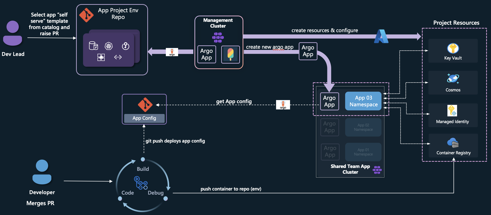

# Platform Engineering Concepts with Azure Part 3 (DRAFT)

## Deploy a cloud native app with a full app environment in Azure
A cloud native app is made up of more than just a namespace and an Argo Application, you may also need an Identity, access to a secret store, database, observability etc. 

In this part of the demo we will use Crossplane to deploy an application to an existing AKS cluster:



1. Create a project specific resource group, deploy all the resources, setup the permissions for the identity etc as before, put the CosmosDB connection string into key vault, etc.  
2. Crossplane creates another Argo App config on the Shared App cluster, the apps of apps pattern, this then connects to the developers app repo that contains the templated app helm chart and reconciles CREATING an isolated project NAMESPACE for the team, deploys a container with a workload identity configuration so the container can connect to an Azure Key Vault to get the CosmosDB connection string.
  
    > Note!
      * In the example we will not create a CosmosDB instance to save costs, but you will see the mechanics of how you can achieve this. We will simulate the pod retrieving the secret by manually creating it in K8s and then using Crossplane to create a secret from it.
      * The example is not perfect, there is so much more automation and best practice, but we need to ship some documentation!! Again, to reiterate it is designed to show you examples of using Crossplane with Azure.

## Pre reqs
1. You will need the cluster in the previous step
2  You will need to have these properties available and update the configurations when noted:
  * Cluster Name e.g. my56cluster
  * Cluster Resource Group, e.g. my56app-kzzj2
  * Kubelet user assigned identity resource identity that you previously created, e.g.
    * /subscriptions/<subscriptionId>/resourceGroups/<mgmtClusterResGroup>/providers/Microsoft.ManagedIdentity/userAssignedIdentities/kbl-infra002-uai

### Step 1 : Simulating a Cosmos DB connection string
As mentioned, we are not going to create a Cosmos DB connection string in the sample, but we're going to assume you have used a [CosmosDB provider](https://marketplace.upbound.io/providers/upbound/provider-azure-cosmosdb/latest/resources/cosmosdb.azure.upbound.io/Account/v1beta1) that has retrieved the connection string and written it to a secret.

* Add the secret to the management cluster:

```bash
cat <<EOF | kubectl apply -f -
apiVersion: v1
kind: Secret
metadata:
  name: db-conn-string
  namespace: upbound-system
type: Opaque
stringData:
  db-conn-string: mongodb://mongo-app1-connection-string
EOF
```

### Step 2 : Creating a new XRD
* From the cloned repo you will have this file that describes the ARD: `mgmtCluster/bootstrap/xp-compositions/xp-full-app-env-definitions.yaml`
As defined in the XRD, we want to let the developers configure these properties:
```yaml
properties:
  spec:
    type: object
    properties:
      appname:
        type: string
      repourl:
        type: string
      repopath:
        type: string
      location:
        type: string
        oneOf:
          - pattern: '^EU$'
          - pattern: '^US$'
    required:
      - location
```

1. teamname - this is used to prefix the name of the Crossplane claim for identification of the owning team.
2. appname - application name
3. repourl - e.g. 'https://github.com/danielsollondon/teaminfra/'
4. repopath - e.g. 'infra/shared/k8s-cluster-config/main-infra-002'


Add the XRD to the cluster, you can do this by (assuming you are in the end2end-cp directory):

* Add the file to the `controlplane` directory and allow the existing Argo App to apply it automatically (preferred): 
```bash
cp mgmtCluster/bootstrap/xp-compositions/xp-full-app-env-definitions.yaml mgmtCluster/bootstrap/control-plane/xp-full-app-env-definitions.yaml
```

* Or apply it directly
```bash
kubectl apply -f mgmtCluster/bootstrap/xp-compositions/xp-full-app-env-definitions.yaml
```

### Step 3 : Creating a new XRC
From the cloned repo you will have this file that describes the ARD: `mgmtCluster/bootstrap/xp-compositions/xp-full-app-env-comp.yaml`, this will need some editing before it is added.

The resource definition is made up of multiple resources, we'll walk through each one and call out how they work in Crossplane where necessary:

1. crossplane-resourcegroup - for each new application we'll create a new resource group that will house all of its dedicated resources

2. crossplane-workload-uai - each application will have its own dedicated [User Assigned Identity (UAI)](https://learn.microsoft.com/en-us/entra/identity/managed-identities-azure-resources/how-manage-user-assigned-managed-identities?pivots=identity-mi-methods-azp), this will be used for [K8s Workload Identity](https://learn.microsoft.com/en-us/azure/aks/workload-identity-deploy-cluster).
 
3. crossplane-get-cluster-details - as this XRC will be setting up the workload identity, we will need to create federated identity credentials in Microsoft Entra UAI, for this we need the oidcIssuerUrl from the AKS cluster. To get access to the existing cluster properties we will need to [import into Crossplane](https://docs.crossplane.io/latest/guides/import-existing-resources/) the existing AKS cluster you created in the previous section or have access to one of the same specification. You will be setting the Crossplane Management Policies to 'Observe' and providing the Azure Cluster Name and resource group name, this means Crossplane only observes the resource and doesn’t make updates, here are the salient parts:

```yaml
  apiVersion: containerservice.azure.upbound.io/v1beta1
  kind: KubernetesCluster
  metadata:
    annotations:
      crossplane.io/external-name: my56cluster
  spec:
    managementPolicies: ["Observe"]
    forProvider:
      resourceGroupName: my56app-kzzj2
```
This resource will return back the oidcIssuerUrl and set it as label.

4. name: crossplane-uai-fed -this sets up the Federated Identity credential, here we are using the `appname` input to set the K8s Namespace name and K8s Service Account name that is required for the `subject`. Note the K8s Namespace name and K8s Service Account name are created by the [Helm Chart](https://github.com/danielsollondon/teaminfra/blob/main/infra/shared/k8s-cluster-config/main-infra-002/templates/app-ns-only.yaml) that is deployed as part of this.

5. crossplane-kv - here we are creating the Azure Key Vault that will be used to store the DB Connecton string secret, and can be used by the app for more secrets.

6. crossplane-get-operating-uai-prinID - for the proceeding steps we need to inject the DB Connecton string secret into Azure Key Vault, this will be perfomed using the UAI that Crossplane uses to authenticate with Azure. Therefore we need to get the Crossplane UAI principal identity and grant RBAC policy to inject the secret, to get access to this we are importing the UAI in the same way as the K8s cluster, then setting an annotation with the principal Id. 


One callout here, at the time of authoring the annotation required the full resourceID of the UAI.
```yaml
apiVersion: managedidentity.azure.upbound.io/v1beta1
kind: UserAssignedIdentity
metadata:
  annotations:
    crossplane.io/external-name: /subscriptions/<subscriptionId>/resourceGroups/<mgmtClusterResGroup>/providers/Microsoft.ManagedIdentity/userAssignedIdentities/kbl-infra002-uai
spec:
  managementPolicies: ["Observe"]
  forProvider:
    resourceGroupName: <mgmtClusterResGroup>
```
You will need update this with your UAI prior to deployment.

7. name: crossplane-role-assign-pri -this creates a role definition for the Crossplane UAI, granting it the `Key Vault Secrets Officer` role to the Key Vault.

8. crossplane-db-secret -this injects the DB Connection string secret into the Key Vault.

9. crossplane-role-assign-reader -the K8s workload identity UAI for the application's namespace will require read permissions on the Key Vault to read the DB Connection String key. Here we assign the workload identity UAI the `Key Vault Secrets User` role.

10. create-argo-app - to deploy the [app](https://github.com/danielsollondon/teaminfra/infra/shared/k8s-cluster-config/main-infra-002) that will pass values to the Helm chart to configure the application on deployment, the Apps of Apps pattern.


11. Add an Environment Configuration
The composition can be deployed on an existing K8s cluster with Argo, however you need to have a method where it knows which cluster to connect to and configure. There are multiple ways you can do this, for example:
  * Use [Crossplane Environment Configurations (Alpha)](https://docs.crossplane.io/latest/concepts/environment-configs/), you can use this to contain a configuration in a similar to a K8s ConfigMap and allows you to patch resources in a composition.
  * Use the region input and that transform to a clustername, in the same we have used with location where an end user passes in EU or US and there is a [Crossplane Map Transform](https://docs.crossplane.io/latest/concepts/patch-and-transform/#map-transforms) in the XRC that selects a valid Azure region.
  * Fleet - you could avoid even specifying a ClusterName and use a preconfigured [AKS Fleet Manager](https://marketplace.upbound.io/providers/upbound/provider-azure-containerservice/latest/resources/containerservice.azure.upbound.io/KubernetesFleetManager/v1beta1) to coordinate workload placement based on other properties, such as location, environment etc. This would need to be setup ahead of time.

For this example we are going to use Crossplane Environment Configuration, and add our staging cluster configuration to it.

12. Enable the Enviroment Configuration option in Crossplane[--enable-environment-configs](https://docs.crossplane.io/latest/concepts/environment-configs/#enable-environmentconfigs).

13. Create the Configuration
You will need to create an Environment configuration on the management cluster. 

In the `mgmtCluster/bootstrap/control-plane/` directory add this file:

```bash
#You will need to update the YAML below with the values created in in Step 2.
dsClusterName=<DOWNSTREAM CLUSTER NAME> e.g. my56cluster
dsCluRgname=<DOWNSTREAM CLUSTER RG NAME> e.g. my56app-kzzj2
# this is the kubelet user assigned identity used to create the mgmt cluster. 
kblAksUai=kbl-infra002-uai
$mgmtClusterRg=rg-infra-01
kblAksUaiId=$(az identity show --name $kblAksUai  --resource-group $resourceGroup --query id --output tsv)

# NOTE the Crossplane managedidentity provider was case sensitive and expects the external name reference to be in this format and case:

#/subscriptions/<subId>/resourceGroups/<mgmtclusterrg>/providers/Microsoft.ManagedIdentity/userAssignedIdentities/kbl-infra002-uai


cat envConfig.yaml <<EOF
apiVersion: apiextensions.crossplane.io/v1alpha1
kind: EnvironmentConfig
metadata:
  name: base-app-config-team01
  namespace: upbound-system
data:
  clustername: $dsClusterName
  clusterrgname: $dsCluRgname
  kblaksuaiid: $kblAksUai
  mgmtclusterrg: $mgmtClusterRg
EOF

```

14. Commit file to the repo in the `mgmtCluster/bootstrap/control-plane/` directory, Argo will then apply this.


15. Add the XRD to the cluster

Add the XRD to the cluster, you can do this by (assuming you are in the end2end-cp directory):

* Add the file to the `controlplane` directory and allow the existing Argo App to apply it automatically (preferred): 
```bash
cp mgmtCluster/bootstrap/xp-compositions/xp-full-app-env-definitions.yaml mgmtCluster/bootstrap/control-plane/xp-full-app-env-comp.yaml
```

* Or apply it directly
```bash
kubectl apply -f mgmtCluster/bootstrap/xp-compositions/xp-full-app-env-comp.yaml
```

16. Deploy workloads to cluster
This will create 2x workloads, deploy an app that will get access to the db connection string in the Key Vault secret.

```bash
appname=baseapp01app
appname2=baseapp02app
teamname=team01
repourl="https://github.com/danielsollondon/teaminfra/"
repopath="infra/shared/k8s-cluster-config/main-infra-002"


cat team1-apps.yaml <<EOF
apiVersion: compute.example.com/v1alpha1
kind: base-stateful-app
metadata:
  name: $appname
spec: 
  location: EU
  appname: $appname
  repourl: $repourl
  repopath: $repopath
---
apiVersion: compute.example.com/v1alpha1
kind: base-stateful-app
metadata:
  name: $appname2
spec: 
  location: EU
  appname: $appname2
  repourl: $repourl
  repopath: $repopath

EOF
```
Commit file to the repo in the `mgmtCluster/bootstrap/app-workloads/` directory, Argo will then apply this.

17. Check the deployment
Here are some useful Crossplane commands:
```bash
# get a list of the claims associated with the CRD
kubectl get base-stateful-app.compute.example.com 

# get details for a specific claim
kubectl describe base-stateful-app.compute.example.com/$appname

kubectl describe base-stateful-app.compute.example.com/$appname2

# show all managed Crossplane resources
kubectl get managed

# get the details for specifc managed resources
kubectl describe userassignedidentity.managedidentity.azure.upbound.io/team01-ngp68

# get events
kubectl get events
```

18. Check that the secret is available to the Pod
```bash
# get the kubeconfig for the downstream AKS cluster
dsClusterName=<DOWNSTREAM CLUSTER NAME> e.g. my56cluster
dsCluRgname=<DOWNSTREAM CLUSTER RG NAME> e.g. my56app-kzzj2

az aks get-credentials --resource-group $dsClusterName --name $dsCluRgname --file DSCLU01

# connect and see the connection string for both apps
KUBECONFIG=DSCLU01 kubectl exec -it busybox-secrets-store-inline-user-msi -n $appname printenv | grep db-conn


KUBECONFIG=DSCLU01 kubectl exec -it busybox-secrets-store-inline-user-msi -n $appname1 printenv | grep db-conn
```

19. Clean up
```bash
rm team1-apps.yaml
```
Commit and push to the repo.

## Summary
You just simulated creating a preconfigured application environment that configured a shared team AKS cluster with a workload identity, namespace, service account, created these Azure resources Azure Key Vault, Secrets, UAI and then created an Argo App and deployed an application that could connect to the Key Vault without a password and get the secret! At no point did the end user have to know anything about Kubernetes, deployment pipelines or Azure, it was all abstracted away.

As mentioned, this was not a lesson in best practice but to familarize you with how you can use Crossplane and Argo as some building blocks for self service platforms on Azure.